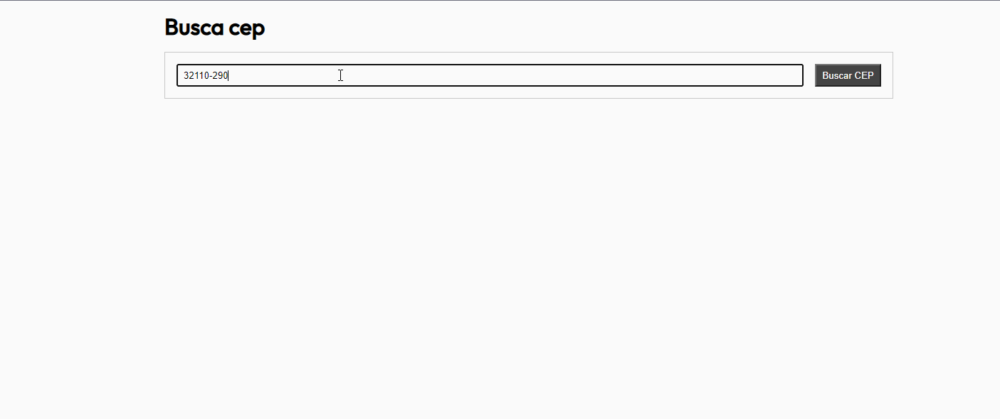

<h1 align="center">
  
</h1>

## 🚀 Tecnologias

---

Esse projeto foi desenvolvido com as seguintes tecnologias:

- ReactJS
- Typescript
- SASS
- Jest

## 💻 Projeto

---

Esse projeto é baseado em desafio para uma vaga na PetLove com o objetivo de demonstrar o fluxo de desenvolvimento com TDD. O deploy foi realizado na Vercel e pode ser acessado [clicando aqui](https://busca-cep-petlove-front-end.vercel.app/).

### Rodando localmente

---

1. Instalar todos os pacotes com `yarn install`
2. Executar o comando `yarn start`
3. Em alguns seguntos a URL: `http://localhost:3000/` ficará disponível

### Rodando os testes

---

- Para executar todos os testes execute o comando `yarn test`
- Para ver a cobertura do projeto execute o comando `yarn test -- --coverage .`
- O relatório de cobertura será gerado dentro de `coverage/lcov-report/index.html`

## 🔖 Informações do desafio original

---

Você pode visualizar todas as informações sobre o desafio [desse link](https://github.com/petlove/vagas/tree/master/frontend)

Feito ao vivo na <a href="https://twitch.tv/devlucaslopes" target="_blank">Twitch</a>.

